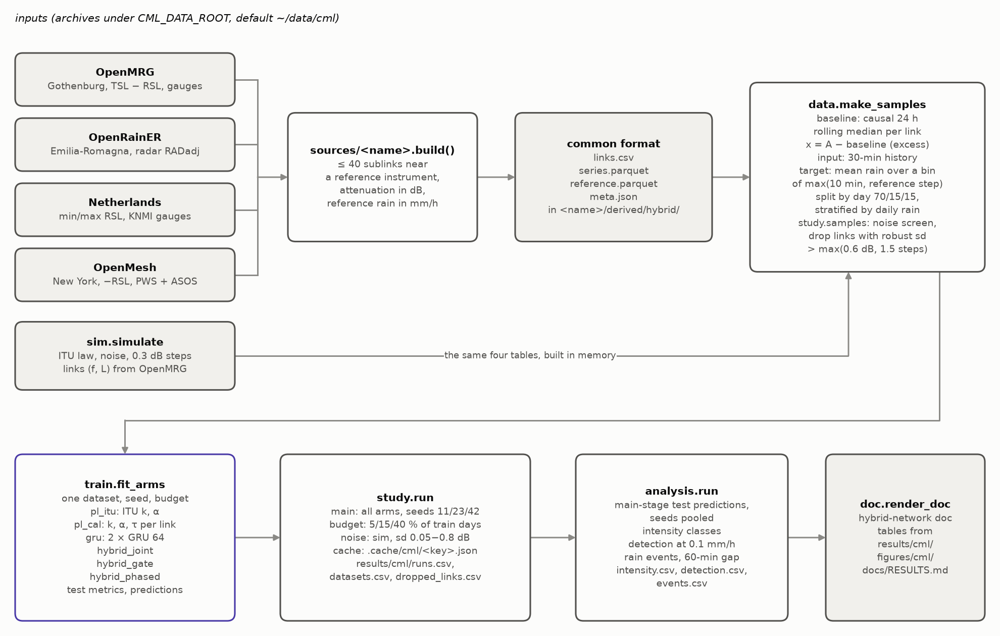
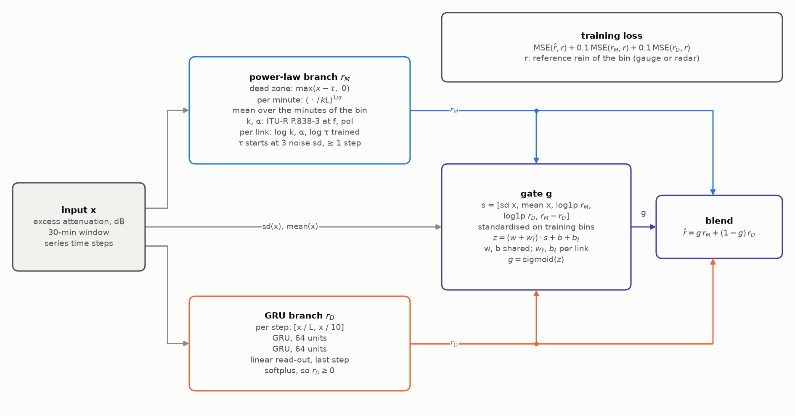
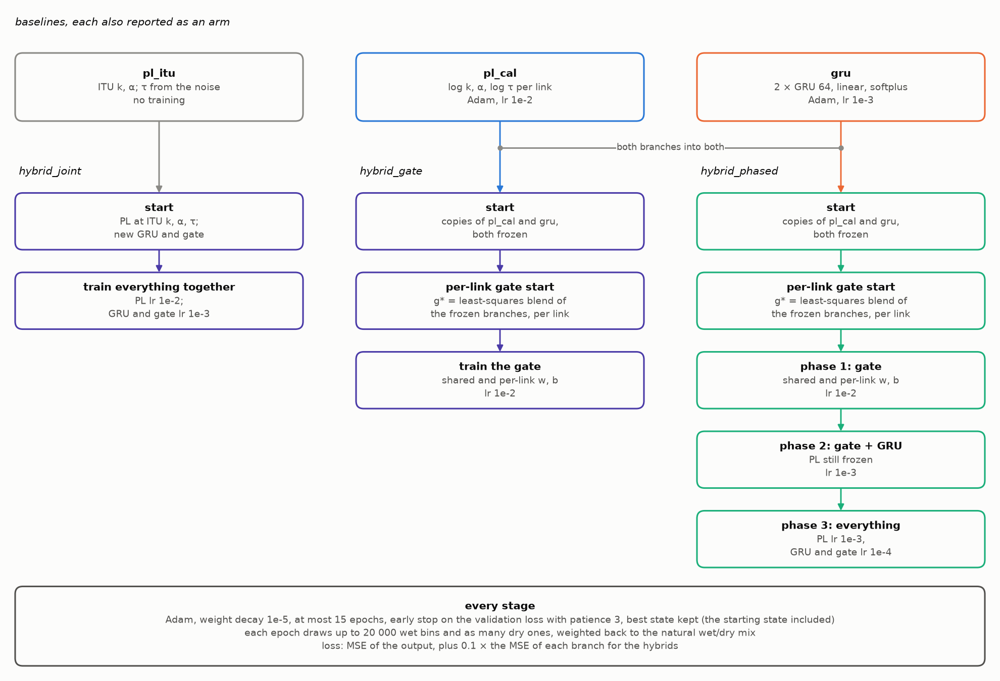
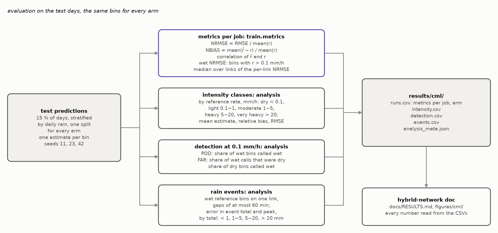

# Hybrid network with dynamic gating: rain from commercial microwave links

Rain attenuates the signal of a commercial microwave link. This project
turns that attenuation into a rain rate in three ways and compares them on
four public link archives and on simulated links:

- a power law with the ITU-R P.838-3 coefficients, fixed or calibrated per
  link;
- a GRU trained on gauge or radar labels;
- the gated hybrid of Jacoby et al., "Rainfall retrieval from wireless links
  via hybrid learning with dynamic gating" (ICASSP 2026), which runs both
  and blends them with a learned gate.

The setup, the splits and the results are built here from scratch. The
paper's numbers are not reused. The plan, and every change made to it while
running, is in [docs/PLAN.md](docs/PLAN.md).

## Method

A link of length $L$ at frequency $f$ loses $A = k R^{\alpha} L$ dB in rain
of $R$ mm/h, with $k$ and $\alpha$ from ITU-R P.838-3 for $f$ and the
polarisation. The input is the excess attenuation $x_t = A_t - b_t$, where
$b_t$ is a causal 24-h rolling median of $A$ on that link.

Power-law branch. Each minute of the target bin gives a rate, and the
branch returns their mean:

$$r_M = \frac{1}{m}\sum_{t \in \text{bin}} \left(\frac{\max(x_t - \tau,\ 0)}{k L}\right)^{1/\alpha}.$$

The dead zone $\tau$ starts at three times the link's robust noise sd and
never below one quantisation step. In the calibrated branch $\log k$,
$\alpha$ and $\log \tau$ are trained per link.

Network branch. Two GRU layers of 64 units read the 30-min history, with
the per-step input $[x_t / L,\ x_t / 10]$, followed by a linear read-out and a
softplus: $r_D \ge 0$.

Gate and blend. With the features

$$s = [\operatorname{sd}(x),\ \operatorname{mean}(x),\ \log(1 + r_M),\ \log(1 + r_D),\ r_M - r_D],$$

standardised on the training bins,

$$g = \sigma\big((w + w_\ell)\cdot s + b + b_\ell\big), \qquad \hat r = g\, r_M + (1 - g)\, r_D,$$

where $w, b$ are shared and $w_\ell, b_\ell$ belong to link $\ell$. The paper
fits one model per link; the per-link terms play that role here.

Loss. $\mathcal L = \mathrm{MSE}(\hat r, r) + 0.1\,\mathrm{MSE}(r_M, r) + 0.1\,\mathrm{MSE}(r_D, r)$,
so neither branch stops learning when the gate saturates.

Six arms are trained and scored:

| arm | what is trained |
|---|---|
| `pl_itu` | nothing: ITU $k$, $\alpha$ and the noise-based $\tau$ |
| `pl_cal` | $\log k$, $\alpha$, $\log \tau$ per link |
| `gru` | the GRU branch alone |
| `hybrid_joint` | power law from ITU values, a new GRU and the gate, all together |
| `hybrid_gate` | the gate only, on frozen copies of `pl_cal` and `gru` |
| `hybrid_phased` | the gate, then gate and GRU, then everything at a tenth of the learning rate |

## Pipeline



Each archive is reduced by its builder to one format of four files
(`sources/common.py`). The simulator returns the same four tables in memory.
`data.make_samples` cuts them into samples, `train.fit_arms` trains the six
arms on one dataset, seed and data budget, `study` runs every job and caches
it, `analysis` breaks the main results down, and `doc` writes the results
page.

The hybrid model:



How each arm is trained:



What is measured:



The diagrams are drawn by `src/hybrid_network/diagrams.py` (`hybrid-network diagrams`).

## Datasets

The data never enter this project. The archives live under the CML data
root, `~/data/cml` unless `CML_DATA_ROOT` says otherwise, and each builder
writes its output to `<root>/<name>/derived/hybrid/`.

| dataset | what it is | signal | reference | archive | builder |
|---|---|---|---|---|---|
| OpenMRG | SMHI links in Gothenburg, June to August 2015 | TSL − RSL, 10 s averaged to 1 min; vertical sublinks at 28-30 and 38-40 GHz | city rain gauges within 3 km of the link midpoint, 1 min | `openmrg/` | `sources/openmrg.py` |
| OpenRainER | links in Emilia-Romagna, 2021-2022; the six wettest months | TSL − RSL, 1 min; 15-40 GHz | gauge-adjusted radar (RADadj) along the path, 15 min | `openrainer/` | `sources/openrainer.py` |
| Netherlands | RAINLINK links, May to August 2012 | min and max RSL over 15 min, no TSL | KNMI automatic gauges within 3 km, hourly (June to August) | `netherlands/` | `sources/netherlands.py` |
| OpenMesh | community mesh network in New York; six wettest months between October 2023 and June 2024 | −RSL in 1 dB steps, 8 s averaged to 1 min; 24 and 60 GHz sublinks | quality-controlled weather stations and ASOS within 3 km, 15 min | `openmesh/` | `sources/openmesh.py` |
| simulation | four scenarios on links with the frequencies and lengths of OpenMRG | ITU law, Gaussian noise, 0.3 dB quantisation, optional wet antenna | the simulated rain | none | `sim.py` |

Each module docstring gives the exact files read, the selection rules and
the quirks of its archive. The simulation scenarios are i.i.d. or AR(1)
rain, each with and without wet-antenna attenuation; the rain parameters
are fitted to the OpenMRG gauge record.

## How to run

Install into a Python 3.11+ environment:

```sh
pip install -e '.[dev]'
```

Then:

```sh
hybrid-network build                 # reduce the archives under CML_DATA_ROOT
hybrid-network run                   # every stage, then docs/RESULTS.md (hours)
hybrid-network run --stage main --workers 4
hybrid-network run --quick           # one seed, short training, results/cml_quick/
hybrid-network doc                   # docs/RESULTS.md and figures/cml/ from results/cml/
hybrid-network diagrams              # figures/diagrams/*.png
```

`python -m hybrid_network` works the same way. `make test`, `make lint`,
`make run`, `make doc` and `make diagrams` wrap the same commands; the tests
of a built dataset are skipped when that dataset has not been built.

Outputs go under the project root (the folder with `pyproject.toml`):
`results/cml/` for tables, `figures/` for figures, `.cache/cml/` for cached
jobs and samples, `docs/` for the generated page. `HYBRID_NETWORK_RESULTS_DIR`
and `HYBRID_NETWORK_CACHE_DIR` move the results and the cache. A job's cache key
covers its dataset, seed, budget, arms, noise level, training configuration
and the code version, so an interrupted run resumes where it stopped.

## Layout

| module | responsibility |
|---|---|
| `config.py` | project root and output paths, environment overrides |
| `checks.py` | `require()`, input checks that raise `ValueError` |
| `seeds.py` | tuning seeds and report seeds |
| `style.py` | figure surface, ink colours, arm palette |
| `itu.py` | ITU-R P.838-3 table and `k_alpha(f, pol)` |
| `sources/common.py` | the common format, its validation and loading |
| `sources/openmrg.py`, `openrainer.py`, `netherlands.py`, `openmesh.py` | one builder per archive |
| `sim.py` | simulated links with a known law |
| `data.py` | baseline, excess attenuation, samples, day split, data budgets |
| `models.py` | power-law branch, GRU branch, gated hybrid |
| `train.py` | training of the six arms, metrics |
| `study.py` | stages, jobs, noise screen, cache, `results/cml/*.csv` |
| `analysis.py` | intensity classes, detection, rain events |
| `doc.py` | `docs/RESULTS.md` and `figures/cml/` from the CSVs |
| `diagrams.py` | the four block diagrams |
| `cli.py`, `__main__.py` | the `hybrid-network` command |

## Protocol

- Samples are bins of max(10 min, reference step) on one link. The input
  is the excess attenuation over the 30 min that end with the bin; the
  target is the mean reference rain over the bin. Bins with more than 20 %
  of the input missing, or without a reference, are dropped.
- Days are split 70/15/15 into train, validation and test, stratified by
  daily rain and drawn with a fixed generator. The split is the same for
  every arm and never depends on a model seed.
- Before modelling, links whose label-free robust noise sd on the training
  days exceeds max(0.6 dB, 1.5 quantisation steps) are dropped and listed in
  `results/cml/dropped_links.csv`.
- Model seeds 3, 7 and 19 are for tuning; 11, 23 and 42 are reported.
- Early stopping uses the validation days only. Each training stage keeps
  its best validation state, and the state it started from counts as a
  candidate.
- Stages: `main` (every dataset and arm, full training set), `budget` (5,
  15 and 40 % of the training days) and `noise` (two simulations at noise sd
  from 0.05 to 0.8 dB, seed 11).
- Metrics on every test bin: NRMSE = RMSE / mean(r), NBIAS = mean(r̂ − r) /
  mean(r), the correlation, NRMSE on wet bins (r > 0.1 mm/h), and the median
  over links of the per-link NRMSE. The analysis adds the error by intensity
  class, detection scores at 0.1 mm/h, and the error in the total and peak
  of rain events.

## Results

The results page is [docs/RESULTS.md](docs/RESULTS.md). It is written by
`hybrid-network doc` from `results/cml/*.csv`, and every number on it is read
from those files. The page is not edited by hand.

## Data sources and licences

The repository holds code, derived results and figures, never the link
data. To rerun it, obtain each archive from its source and place it under
the CML data root.

| dataset | source | licence |
|---|---|---|
| OpenMRG | SMHI, Andersson et al., doi:10.5281/zenodo.6673750 | CC BY-SA 4.0 |
| OpenRainER | ARPAE-SIMC and Lepida ScpA, doi:10.5281/zenodo.10593848 | CC BY 4.0 |
| Netherlands | Overeem et al. (2024), doi:10.4121/be252844-b672-471e-8d69-27269a862ec1.v1; KNMI hourly station data | CC BY 4.0 (links) |
| OpenMesh | NYC Mesh links and New York weather networks, collected by the author | not redistributed |

## Related projects

- [physics-prior](https://github.com/drorjac/physics-prior): what a physics
  prior is worth in machine learning, on real measured data and
  simulations. It contains the same study as `physprior.cml`, and runs the
  gated hybrid on its other tracks.
- [qphys](https://github.com/drorjac/qphys): quantum formalism as a
  modelling language.

## License

MIT, see [LICENSE](LICENSE).
